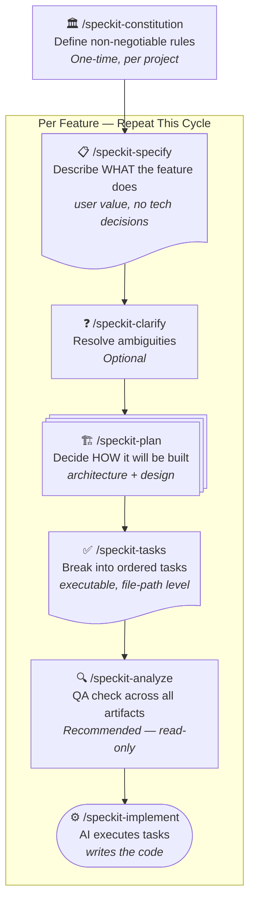

# SpecKit Developer Guide
### Spec Driven Development with Claude Code

**Audience**: Experienced Java / Python developers, new to SDD and Spec-Kit  
**Goal**: Understand the full lifecycle, write great prompts at every step, and review generated artifacts confidently

---

## Table of Contents

1. [The Core Idea — Why SDD?](#1-the-core-idea--why-sdd)
2. [The Spec-Kit Lifecycle at a Glance](#2-the-spec-kit-lifecycle-at-a-glance)
3. [Project Setup (One-Time)](#3-project-setup-one-time)
4. [Step 0 — Constitution (`/speckit-constitution`)](#4-step-0--constitution-speckit-constitution)
5. [Step 1 — Specify (`/speckit-specify`)](#5-step-1--specify-speckit-specify)
6. [Step 2 — Clarify (`/speckit-clarify`) — Optional](#6-step-2--clarify-speckit-clarify--optional)
7. [Step 3 — Plan (`/speckit-plan`)](#7-step-3--plan-speckit-plan)
8. [Step 4 — Tasks (`/speckit-tasks`)](#8-step-4--tasks-speckit-tasks)
9. [Step 5 — Analyze (`/speckit-analyze`) — Recommended](#9-step-5--analyze-speckit-analyze--recommended)
10. [Step 6 — Implement (`/speckit-implement`)](#10-step-6--implement-speckit-implement)
11. [Git Skills — Brief Overview](#11-git-skills--brief-overview)
12. [Common Mistakes and How to Avoid Them](#12-common-mistakes-and-how-to-avoid-them)
13. [Quick Reference Card](#13-quick-reference-card)

---

## 1. The Core Idea — Why SDD?

### The Problem with Traditional AI-Assisted Development

When you write code with AI assistance today, the typical flow is:

> "Build me a RAG pipeline that takes PDFs, embeds them, and answers questions."

The AI produces code. You test it. Something is missing. You add more. You refactor. Two days later your codebase is a pile of patches and the AI has lost context about what was originally intended.

**The root cause**: You gave the AI an instruction, not a specification. There is no shared written agreement about *what success looks like*.

### What SDD Changes

Spec Driven Development (SDD) forces you to write down — before any code is touched — three things:

1. **What** the system must do (the spec)
2. **How** it will be built (the plan)
3. **In what order** (the tasks)

Only then does an AI implement it. This document stays as the living record of intent. When the AI loses context, you point it back at the spec. When a teammate joins, they read the spec instead of reverse-engineering the code.

### The Mental Model Shift

| Old thinking | SDD thinking |
|---|---|
| "Tell the AI what to build and check the output" | "Write down what success looks like, then let the AI implement against it" |
| Requirements live in your head | Requirements live in `spec.md` |
| Architecture is figured out during coding | Architecture is decided in `plan.md` before coding |
| Tasks are made up as you go | Tasks are generated from the plan and checked for coverage |
| AI implements whatever it thinks you meant | AI implements against a contract it can always re-read |

### Why This Matters for AI Projects Specifically

AI systems (RAG pipelines, chatbots, ML APIs) are particularly prone to scope creep and invisible design decisions: Which embedding model? What chunk size? How do you handle context overflow? SDD forces these decisions *up front*, in writing, before they silently get baked into code that's hard to change.

---

## 2. The Spec-Kit Lifecycle at a Glance

```
[One-time, per project]
/speckit-constitution  ←  Define your project's non-negotiable rules

[Per feature, repeat this cycle]
/speckit-specify       ←  Describe WHAT the feature does (user value)
      ↓
/speckit-clarify       ←  (Optional) Resolve ambiguities before design
      ↓
/speckit-plan          ←  Decide HOW it will be built (architecture + design)
      ↓
/speckit-tasks         ←  Break it into ordered, executable tasks
      ↓
/speckit-analyze       ←  (Recommended) QA check across all artifacts
      ↓
/speckit-implement     ←  AI executes tasks and writes the code
```



Each step produces files that feed the next step. Nothing is generated from thin air — each command reads the previous output.

**Files produced per feature:**

```
specs/
└── 001-rag-qa-system/
    ├── spec.md          ← created by /speckit-specify
    ├── plan.md          ← created by /speckit-plan
    ├── research.md      ← created by /speckit-plan
    ├── data-model.md    ← created by /speckit-plan
    ├── quickstart.md    ← created by /speckit-plan
    ├── contracts/       ← created by /speckit-plan (API contracts)
    ├── tasks.md         ← created by /speckit-tasks
    └── checklists/      ← created during specify and checklist steps
```

---

## 3. Project Setup (One-Time)

Before you use any Spec-Kit commands, your project needs the `.specify/` directory structure. This is already present if you started from the Spec-Kit template.

**Verify setup:**

```
.specify/
├── memory/
│   └── constitution.md    ← your project's law
├── templates/             ← Spec-Kit uses these internally
├── scripts/               ← shell scripts used by commands
└── extensions.yml         ← git hook configuration
```

If this directory is missing, Spec-Kit commands will fail. Contact your project maintainer or follow the Spec-Kit installation guide.

**Git hooks are pre-configured.** When you run `/speckit-specify`, it will automatically offer to create a git feature branch. When you finish a step, it will offer to auto-commit. These are optional hooks — you will be prompted each time.

---

## 4. Step 0 — Constitution (`/speckit-constitution`)

### What It Is

The constitution is your project's **law**. It defines non-negotiable rules that every feature must follow. Spec-Kit reads it during planning and will flag violations before allowing implementation to proceed.

Think of it as: "What are the hard rules our team agreed on that no feature is allowed to break?"

**Location**: `.specify/memory/constitution.md`  
**When**: Once, when starting the project. Update it when the team agrees on new rules.

### How to Invoke

```
/speckit-constitution [your principles and rules as a description]
```

If you run it with no arguments, it will interactively ask for your principles. If you provide a description, it uses that as input.

### What to Write

Pass a plain-language description of your project's principles. The command will structure them correctly.

**Good input for an AI project:**

```
/speckit-constitution

Project: RAG-based Q&A API built in Python using FastAPI.

Principles:
1. API-First: Every feature must be accessible via a REST endpoint. No feature is complete without a documented API contract.
2. Retrieval Accuracy is Non-Negotiable: Every change to the embedding pipeline, chunking strategy, or retrieval logic must be benchmarked against a fixed evaluation set before merging.
3. Test-First: Tests must be written and confirmed failing before implementation begins. No exceptions.
4. Observability Required: Every API endpoint and retrieval step must emit structured logs with request ID, latency, and token counts.
5. Model Isolation: The LLM provider must be swappable via configuration. No hardcoded OpenAI or Anthropic SDK calls in business logic — always go through an abstraction layer.

Tech stack: Python 3.11, FastAPI, LangChain, PostgreSQL + pgvector, pytest.
Deployment: Docker containers on AWS ECS.
```

### What NOT to Write

| Don't write | Why |
|---|---|
| Implementation instructions ("use langchain's RecursiveCharacterTextSplitter") | The constitution sets policy, not recipes. Recipes go in the plan. |
| Vague wishes ("code should be clean") | Every principle must be testable. "Clean" cannot be verified. |
| Feature-specific rules ("the PDF ingestion endpoint must return 200") | That belongs in a feature spec, not the constitution. |
| Team process rules ("PRs need 2 approvals") | Constitution governs technical decisions, not team workflows. |

### What to Expect as Output

Spec-Kit will:
1. Fill `.specify/memory/constitution.md` with your principles formatted as declarative `MUST` rules
2. Assign a semantic version (e.g., `1.0.0`)
3. Propagate the principles to all templates (plan, spec, tasks) so they can reference them
4. Print a **Sync Impact Report** showing which templates were updated

### How to Review the Constitution

Open `.specify/memory/constitution.md` and check:

- [ ] Every principle has **non-negotiable rules** written as `MUST` or `MUST NOT` statements
- [ ] Each principle is **testable** — you can write a checklist item that passes or fails
- [ ] No principle is vague (look for words like "robust", "intuitive", "good", "clean" — these must be replaced with measurable criteria)
- [ ] The **Technology Stack & Standards** section matches your actual stack
- [ ] The **Development Workflow** section lists the Spec-Kit steps in order
- [ ] The **Governance** section explains how to amend the constitution

> **TIP**: Read each MUST statement aloud and ask "How would I verify this is satisfied in a code review?" If you can't answer that, the rule is too vague. Ask the AI to sharpen it.

> **TIP**: The constitution is not a wish list. It is a gate. If you put a principle in there, Spec-Kit will block implementation if it is violated. Only put rules your team genuinely enforces.

---

## 5. Step 1 — Specify (`/speckit-specify`)

### What It Is

Specify translates your feature idea into a structured specification document (`spec.md`). It captures:
- What users need (user stories with priorities)
- What the system must do (functional requirements)
- What success looks like (measurable outcomes)
- What is assumed (assumptions)

**The golden rule of specify**: Write about WHAT users need and WHY, never HOW it will be built.

### How to Invoke

```
/speckit-specify [natural language description of the feature]
```

Everything after `/speckit-specify` is your feature description. It becomes the input the AI uses to generate the spec.

### What to Write — The Feature Description

Think of this as a brief you'd hand to a product manager. It should cover:

- **Who** is the user (developer? end user? admin?)
- **What** they need to accomplish
- **Why** it matters (business/user value)
- **What is in scope** (and ideally what is not)

**Good example (AI project):**

```
/speckit-specify

Build a document ingestion API that allows our internal developer team to upload 
PDF documents and have them indexed for semantic search. 

Developers should be able to upload a PDF via a POST endpoint, receive a job ID, 
and poll for indexing completion. Once indexed, documents should be searchable 
via a separate search endpoint that returns relevant text chunks with source references.

Out of scope for this feature: user authentication, multi-tenancy, document deletion.

Expected scale: up to 100 PDFs per day, each up to 50MB.
```

**Why this works:**
- Identifies the user ("internal developer team")
- States what they need (upload, poll, search)
- Calls out scope boundaries explicitly
- Gives scale context without specifying implementation

### What NOT to Write

| Don't include | Why |
|---|---|
| Tech stack choices ("use LangChain for chunking") | These are plan decisions. Spec must be tech-agnostic. |
| API details ("POST to /api/v1/documents") | Contracts come from the plan, not the spec. |
| Implementation approach ("use async Celery tasks") | Architecture decisions belong in the plan. |
| Database schema ("documents table with vector column") | Data modeling belongs in the plan. |
| Performance targets stated as system metrics ("p95 < 200ms") | State as user experience: "Users see search results within 2 seconds" |

> **TIP**: A good test for your spec description: read it to a non-technical product manager. If they understand what value is being delivered, you've written it correctly. If they need to ask "what's a vector?" or "what framework is that?", you've gone too deep.

### What to Expect as Output

Spec-Kit creates: `specs/001-document-ingestion/spec.md`

The file contains:
- **User Scenarios** (P1, P2, P3... prioritized stories, each independently testable)
- **Functional Requirements** (FR-001, FR-002... each testable)
- **Success Criteria** (SC-001... measurable, technology-agnostic outcomes)
- **Assumptions** (explicit defaults chosen when your description was silent)
- **Edge Cases**

It also creates `specs/001-document-ingestion/checklists/requirements.md` — a quality checklist.

If the AI found things it cannot infer, it will ask up to **3 clarification questions** with multiple-choice answers before finalizing the spec.

### How to Review spec.md

Open the file and verify:

- [ ] **User Stories are prioritized** — P1 should be your core MVP. P2, P3 are enhancements.
- [ ] **Each user story is independently testable** — you could ship P1 alone and it delivers value
- [ ] **Acceptance scenarios use Given/When/Then** — each one is specific and verifiable
- [ ] **No tech stack language** — no framework names, no database names, no library names
- [ ] **Success criteria are measurable** — "Users receive results within 2 seconds", not "system is fast"
- [ ] **Assumptions make sense** — the AI made reasonable defaults; verify they match your intent
- [ ] **Scope is bounded** — out-of-scope items are listed

> **TIP**: The most common spec mistake is letting "how" language sneak in. Search the file for words like "API", "REST", "database", "table", "endpoint", "JSON". If they appear in the spec (not in assumptions), the spec is too technical. Ask the AI to rewrite those sections in user-value terms.

> **TIP**: Every functional requirement (FR-001) should be answerable with a yes/no test. "System MUST allow users to upload documents up to 50MB" — testable. "System MUST handle documents efficiently" — not testable.

> **WARNING**: Do not proceed to Plan if there are `[NEEDS CLARIFICATION]` markers still in the spec. Either answer them via `/speckit-clarify` or edit the spec manually.

---

## 6. Step 2 — Clarify (`/speckit-clarify`) — Optional

### What It Is

Clarify proactively finds ambiguities in your spec that would cause problems during planning or implementation, and asks targeted questions to resolve them. It saves you from discovering these gaps mid-plan when it's more expensive to backtrack.

**When to run it**: After `/speckit-specify`, before `/speckit-plan`. Skip it only if the spec is already airtight.

### How to Invoke

```
/speckit-clarify
```

Or with focus areas:

```
/speckit-clarify focus on security and data retention requirements
```

### What to Expect

The command scans your spec across multiple categories (functional scope, data model, security, performance, integrations, edge cases) and asks **at most 5 questions**, one at a time.

Each question presents:
- A **recommended answer** with reasoning
- A table of **options** (A, B, C...)
- You respond with a letter, "yes" (to accept the recommendation), or your own short answer

**Example exchange:**

```
Question 1: Search Result Format

Context: "search endpoint that returns relevant text chunks with source references"

What we need to know: Should search results include the full chunk text or just 
a reference to retrieve it separately?

Recommended: Option A — Full chunk text inline
Reasoning: Minimizes round-trips for the common use case; source reference 
included for audit purposes.

| Option | Description |
|--------|-------------|
| A | Return full chunk text + source reference inline |
| B | Return chunk ID + source reference; client fetches full text separately |

Your choice: A
```

After each answer, the spec is updated immediately.

### How to Review

After clarification completes, the command shows a **coverage summary table**:

| Category | Status |
|---|---|
| Functional Scope | Resolved |
| Data Model | Deferred (plan phase) |
| Security | Outstanding |

- **Resolved**: The spec now captures this clearly
- **Deferred**: Intentionally left for the plan phase (technical decisions)
- **Outstanding**: Still unclear but low-impact; can proceed

If any **high-impact** categories remain Outstanding, run clarify again or manually edit the spec before planning.

> **TIP**: Don't rush through clarify questions by just accepting every recommendation. Read the implications column. For AI systems especially, security and data retention questions can have significant downstream consequences.

---

## 7. Step 3 — Plan (`/speckit-plan`)

### What It Is

Plan translates the spec into a concrete technical blueprint. It makes all the architecture and design decisions the spec deliberately avoided. This is where technology choices, data models, API contracts, and file structures are defined.

### How to Invoke

```
/speckit-plan
```

Or with guidance:

```
/speckit-plan prefer async task processing for document ingestion; use pgvector for vector storage
```

Passing guidance is useful when you have strong opinions about architecture that aren't in the constitution. The AI will incorporate them as constraints.

### What to Write (When Providing Arguments)

**Useful guidance to include:**
- Technology preferences not already in the constitution ("use FastAPI over Flask for async support")
- Known constraints ("must integrate with our existing PostgreSQL 15 instance")
- Performance budgets ("embedding must complete within 5 seconds per page")
- Architectural preferences ("prefer event-driven over synchronous for indexing")

**Don't include in arguments:**
- Business requirements (those belong in the spec, which is already written)
- Implementation details at function level (that's the AI's job)

### What to Expect as Output

Plan runs in two phases internally:

**Phase 0 — Research** (`research.md`):
- Resolves every unknown from the spec (embedding model options, chunking strategies, pgvector setup)
- Documents: Decision chosen → Why → Alternatives considered

**Phase 1 — Design** (multiple files):
- `plan.md` — summary, technical context, project structure, constitution check
- `data-model.md` — entities, fields, relationships, validation rules
- `contracts/` — API endpoint definitions (what parameters, what responses)
- `quickstart.md` — how to run and test the feature end-to-end

A **Constitution Check** gate runs before design begins. If your spec or proposed architecture violates a constitution principle, the plan will ERROR and explain what must change. This is intentional — the constitution is law.

### How to Review the Plan Artifacts

**Review `plan.md`:**

- [ ] **Technical Context** has no "NEEDS CLARIFICATION" items — all are resolved
- [ ] **Constitution Check** shows all principles as satisfied (no violations)
- [ ] **Project Structure** matches your actual repo layout (not just a template)
- [ ] **Complexity Tracking** is filled only if there are real constitution violations that need justification

**Review `research.md`:**

- [ ] Every decision has a rationale — not just "we chose X" but "we chose X because Y, and rejected Z because W"
- [ ] Alternatives considered are real alternatives, not strawmen
- [ ] Technology choices are consistent with the constitution's approved stack

**Review `data-model.md`:**

- [ ] All entities from the spec's "Key Entities" section appear here with fields
- [ ] Relationships make sense (foreign keys, one-to-many, etc.)
- [ ] State transitions are documented if the entity has a lifecycle (e.g., document: `pending → indexing → indexed → failed`)

**Review `contracts/`:**

- [ ] Every user story from the spec has at least one corresponding API contract
- [ ] Request/response formats are complete (all required fields, types, error responses)
- [ ] No contracts reference technologies not approved in the constitution

> **TIP**: The most important thing to check in `plan.md` is the Constitution Check. Read each principle from the constitution and trace how this plan satisfies it. If you find a principle that the plan silently ignores, flag it now — fixing it before tasks are generated is much cheaper than after.

> **TIP**: `research.md` is where AI "assumptions" become explicit decisions. Review it carefully. If the AI chose embedding model X over Y, understand why. These decisions are hard to change later.

> **WARNING**: Do not edit `plan.md` to mark constitution violations as "justified" just to get unblocked. The constitution exists to protect you. If the plan genuinely requires a violation, discuss it with your team and amend the constitution first via `/speckit-constitution`.

---

## 8. Step 4 — Tasks (`/speckit-tasks`)

### What It Is

Tasks converts the plan into a dependency-ordered, executable task list (`tasks.md`). Each task is concrete enough for an AI to execute without additional context.

### How to Invoke

```
/speckit-tasks
```

Or with constraints:

```
/speckit-tasks include test tasks, TDD approach
```

By default, test tasks are NOT generated unless you explicitly request TDD. If your constitution mandates test-first development, always include this argument.

### What to Expect as Output

`specs/001-document-ingestion/tasks.md` is organized into phases:

```
Phase 1: Setup        — project initialization, dependencies
Phase 2: Foundational — blocking infrastructure (DB, auth, logging) that ALL stories need
Phase 3: User Story 1 — implementation tasks for P1 story
Phase 4: User Story 2 — implementation tasks for P2 story
...
Phase N: Polish       — cross-cutting concerns, documentation
```

Each task follows a strict format:

```
- [ ] T001 Create project structure per implementation plan
- [ ] T005 [P] Configure pgvector extension in src/db/setup.py
- [ ] T012 [P] [US1] Create Document model in src/models/document.py
- [ ] T014 [US1] Implement DocumentService in src/services/document_service.py
```

**Format explained:**
- `- [ ]` — checkbox (becomes `- [X]` when complete)
- `T001` — sequential task ID
- `[P]` — can run in parallel with other `[P]` tasks in the same phase
- `[US1]` — maps to User Story 1 from the spec
- The description includes the **exact file path**

### How to Review tasks.md

- [ ] **Every user story has a phase** — P1 in Phase 3, P2 in Phase 4, etc.
- [ ] **Phase 2 (Foundational) contains true blockers** — things that genuinely cannot be done story-by-story (e.g., DB schema, auth middleware). Be skeptical if too much is here.
- [ ] **Tasks have exact file paths** — `src/services/document_service.py`, not "the service file"
- [ ] **`[P]` markers are accurate** — parallel tasks must truly write different files with no shared state
- [ ] **Dependencies flow correctly** — models before services, services before endpoints
- [ ] **User Story 1 alone is MVP** — verify you can stop after Phase 3 and have something shippable

> **TIP**: Count the tasks per user story. If P1 (the MVP) has 30 tasks and P3 has 3, that's a signal the MVP isn't scoped tightly enough. The whole point of priorities is that P1 alone delivers value.

> **TIP**: Look for tasks that say "integrate with X" or "wire up Y" in Phase 2 (Foundational). These are often premature optimizations. True foundational tasks are: database setup, environment config, project structure, base error handling. Story-specific wiring belongs in the story's phase.

> **WARNING**: If a task lacks a file path (e.g., "Implement the search feature"), it is not executable by the AI. Run `/speckit-tasks` again or manually add the path before implementing.

---

## 9. Step 5 — Analyze (`/speckit-analyze`) — Recommended

### What It Is

Analyze performs a read-only consistency check across `spec.md`, `plan.md`, and `tasks.md`. It finds gaps, contradictions, and constitution violations before implementation begins. Think of it as a QA gate.

**It never modifies any file.** It only reports findings.

### How to Invoke

```
/speckit-analyze
```

Or with a focus:

```
/speckit-analyze focus on security requirements coverage
```

### What to Expect as Output

A **Specification Analysis Report** with:

1. A **findings table** with severity levels:
   - `CRITICAL` — constitution violation, missing core artifact, requirement with zero task coverage
   - `HIGH` — duplicate/conflicting requirement, untestable acceptance criteria, ambiguous security target
   - `MEDIUM` — terminology drift, underspecified edge case, missing non-functional task
   - `LOW` — wording improvements, minor redundancy

2. A **Coverage Summary Table** — maps every functional requirement (FR-001...) to the task(s) that implement it

3. **Constitution Alignment Issues** — any principle your plan or tasks violate

4. **Metrics** — total requirements, total tasks, coverage %, issue counts

### How to Review the Report

- **Fix CRITICAL issues before proceeding** — the AI will tell you which file to update and how
- **Fix HIGH issues** if they relate to security, scope correctness, or untestable criteria
- **MEDIUM and LOW** — use judgment; they will not block implementation but may cause rework later
- **Coverage Summary** — every FR must have at least one task ID mapped to it. Any FR with "No" in the Has Task column means something was missed.

> **TIP**: Pay special attention to the **Unmapped Tasks** section. These are tasks the AI generated that have no corresponding requirement. They might be gold (necessary infrastructure) or scope creep. Verify each one.

> **TIP**: The analyze command flags "vague adjectives" (fast, scalable, secure, robust) in your spec. If it finds them, your success criteria need sharpening before you implement — otherwise you'll have no way to know if you've succeeded.

---

## 10. Step 6 — Implement (`/speckit-implement`)

### What It Is

Implement is the step where code gets written. The AI reads `tasks.md`, `plan.md`, `data-model.md`, `contracts/`, and `research.md`, then executes each task in order, marking tasks complete as it goes.

### How to Invoke

```
/speckit-implement
```

Or with a filter to implement only a subset:

```
/speckit-implement only implement Phase 3 (User Story 1)
```

This is useful when you want to validate MVP before proceeding to later stories.

### What to Expect

**Before starting**, the AI checks checklists in `specs/001.../checklists/`. If any checklist has incomplete items, it will stop and ask whether to proceed. Do not skip this — incomplete checklists signal that the spec or plan has unresolved gaps.

**During execution**, the AI:
1. Reads all design artifacts (plan, data model, contracts)
2. Creates/verifies `.gitignore` and other project ignore files
3. Executes tasks phase by phase (Setup → Foundational → User Stories → Polish)
4. Marks each completed task as `[X]` in `tasks.md`
5. Respects `[P]` markers — parallel tasks run concurrently
6. Reports progress after each task
7. Stops and explains if a task fails

**When a task fails**, the AI will:
- Report the exact error with context
- Suggest a fix or next step
- Not blindly continue to dependent tasks

### How to Review During Implementation

Watch the output as it runs. Key things to verify:

- **Tasks are being checked off** in `tasks.md` — open the file occasionally to confirm
- **Files are being created at the correct paths** — the task description says `src/models/document.py`; verify that file appears
- **The AI is not hallucinating** — if it says "done" but you see no file, stop and investigate

After implementation completes:

- [ ] Run your test suite manually
- [ ] Follow the `quickstart.md` steps end-to-end
- [ ] Check that all acceptance scenarios from `spec.md` pass
- [ ] Verify constitution compliance (run the checklist from the constitution's Development Workflow section)

> **TIP**: Implement one user story at a time (use the argument filter) rather than the entire feature at once. After each story, run the tests and validate the acceptance criteria manually. Catching issues at the story level is far cheaper than debugging after all stories are "complete".

> **TIP**: The AI marks tasks `[X]` as it completes them. If you stop mid-implementation and come back later, you can run `/speckit-implement` again — it will pick up from where tasks are still `[ ]`.

> **WARNING**: If the AI starts making decisions that weren't in the plan (different file structure, different library), stop it. Point it back at `plan.md` and `contracts/`. Say: "Check plan.md — you're deviating from the agreed structure." The plan is the contract.

---

## 11. Git Skills — Brief Overview

Spec-Kit includes git skills that run automatically as hooks at key lifecycle points. You don't invoke most of these directly — they are triggered by the main commands.

| Skill | When it runs | What it does |
|---|---|---|
| `/speckit-git-initialize` | Before `/speckit-constitution` | Initializes git repo with initial commit if not already initialized |
| `/speckit-git-feature` | Before `/speckit-specify` | Creates a feature branch (e.g., `001-document-ingestion`) |
| `/speckit-git-commit` | After most steps | Offers to auto-commit the generated artifacts |
| `/speckit-git-validate` | On demand | Validates your current branch follows naming conventions |
| `/speckit-git-remote` | On demand | Detects the git remote URL for GitHub integration |

These hooks are configured in `.specify/extensions.yml`. The `optional: true` hooks ask for confirmation; `optional: false` hooks run automatically.

**You do not need to invoke git skills manually** for normal development. They work in the background.

---

## 12. Common Mistakes and How to Avoid Them

### Mistake 1: Writing the spec like a technical ticket

**Wrong prompt:**
```
/speckit-specify Build a FastAPI endpoint POST /api/v1/documents that accepts multipart 
form data, saves the file to S3, and triggers a Celery task to run LangChain's 
RecursiveCharacterTextSplitter with chunk_size=1000 and chunk_overlap=200.
```

**Why it's wrong**: You've made all the technical decisions in the spec. The spec must be tech-agnostic. These decisions belong in the plan.

**Right prompt:**
```
/speckit-specify Allow developers to upload PDF documents so they can be indexed 
for semantic search. Uploading should be asynchronous — developers receive a 
confirmation immediately and can check processing status separately. Documents 
can be up to 50MB each.
```

---

### Mistake 2: Skipping the review steps

The AI will generate a spec, plan, or task list that *looks* complete. Without reviewing, you will miss:
- Assumptions that don't match your intent
- Success criteria that can't actually be measured
- Tasks with missing file paths
- Constitution violations that got glossed over

**Rule**: Never run the next command until you have reviewed the current command's output.

---

### Mistake 3: Treating the constitution as optional

If you skip the constitution or write vague principles, Spec-Kit still runs — but without its most powerful feature: gates. Without clear principles, the plan phase has no rules to check, and the AI will make arbitrary decisions that may conflict with each other across features.

**Rule**: Write the constitution first. Write it carefully. Write specific, testable MUST rules.

---

### Mistake 4: Ignoring `[NEEDS CLARIFICATION]` markers

The spec will sometimes contain `[NEEDS CLARIFICATION: ...]` markers when the AI couldn't make a reasonable default. These are not cosmetic — they mean a decision is pending. If you proceed to plan with these unresolved, the plan will make a guess that may not match your intent.

**Rule**: Resolve all `[NEEDS CLARIFICATION]` markers before running `/speckit-plan`. Use `/speckit-clarify` or edit the spec manually.

---

### Mistake 5: Using "implement all stories" before validating Story 1

Running `/speckit-implement` across all phases at once is tempting. But if the P1 (MVP) story has a fundamental flaw in the design, you will discover it after 40+ tasks have run. By then, the codebase is a tangled mess.

**Rule**: Implement one user story at a time. Validate each story against its acceptance criteria before proceeding.

---

### Mistake 6: Editing generated files without understanding the cascade

If you edit `spec.md` after the plan is generated, the plan may now be inconsistent with the spec. If you edit `plan.md` after tasks are generated, the tasks may reference the old plan structure.

**Rule**: Changes flow downstream. If you change the spec, re-run `/speckit-plan` and `/speckit-tasks`. If you change the plan, re-run `/speckit-tasks`. Never edit a downstream file to paper over an upstream change.

---

### Mistake 7: Amending the constitution mid-feature

If you realize mid-implementation that a constitution principle is wrong, do not just remove the offending rule to unblock yourself. This silently invalidates every past and future feature's compliance check.

**Rule**: Constitution amendments require a deliberate decision. Run `/speckit-constitution` with the amendment, provide the rationale, and let Spec-Kit propagate the change to all templates. Then re-run `/speckit-analyze` on your current feature to see if anything needs updating.

---

## 13. Quick Reference Card

### Command Summary

| Command | Input | Primary Output | Reviews needed |
|---|---|---|---|
| `/speckit-constitution` | Principles in plain language | `.specify/memory/constitution.md` | All MUST rules testable? Principles specific? |
| `/speckit-specify` | Feature in user-value terms | `specs/NNN-name/spec.md` | Tech-agnostic? User stories independent? Criteria measurable? |
| `/speckit-clarify` | (optional focus areas) | Updated `spec.md` | Coverage table — Outstanding items acceptable? |
| `/speckit-plan` | (optional architecture hints) | `plan.md`, `research.md`, `data-model.md`, `contracts/` | Constitution check passed? Decisions justified? |
| `/speckit-tasks` | (optional TDD flag) | `tasks.md` | Every FR has tasks? File paths present? MVP is Story 1 alone? |
| `/speckit-analyze` | (optional focus areas) | Analysis report (read-only) | CRITICAL issues fixed? Full FR coverage? |
| `/speckit-implement` | (optional story filter) | Working code, `[X]` tasks | Tests pass? Acceptance criteria met? Constitution satisfied? |

### What Belongs Where

| Artifact | Spec | Plan | Tasks |
|---|---|---|---|
| User needs and value | ✅ | — | — |
| Business requirements | ✅ | — | — |
| Technology choices | ❌ | ✅ | — |
| Data model / schema | ❌ | ✅ | — |
| API contracts | ❌ | ✅ | — |
| File structure | ❌ | ✅ | — |
| Implementation steps | ❌ | ❌ | ✅ |
| File paths | ❌ | ❌ | ✅ |

### The "Am I ready to proceed?" Checklist

Before running each command, verify:

```
Before /speckit-specify:
  □ Constitution exists and is reviewed

Before /speckit-plan:
  □ spec.md has no [NEEDS CLARIFICATION] markers
  □ All user stories have acceptance scenarios
  □ Success criteria are measurable and tech-agnostic

Before /speckit-tasks:
  □ plan.md Constitution Check passes (no violations)
  □ research.md has decisions for all unknowns
  □ data-model.md and contracts/ are complete

Before /speckit-analyze:
  □ tasks.md exists with all phases

Before /speckit-implement:
  □ /speckit-analyze showed no CRITICAL issues
  □ (Or CRITICAL issues were resolved)
  □ All checklists in checklists/ are complete

After /speckit-implement (per story):
  □ Tests pass
  □ Acceptance scenarios from spec.md verified manually
  □ Constitution compliance confirmed
```

### Prompt Quality Cheat Sheet

| If you're writing for... | Ask yourself... |
|---|---|
| `/speckit-constitution` | "Is this rule testable? Can I write a pass/fail check for it?" |
| `/speckit-specify` | "Could a non-technical PM understand this without asking what technology I'm using?" |
| `/speckit-plan` (arguments) | "Am I expressing a constraint or preference, not a requirement? (Requirements are already in the spec)" |
| `/speckit-tasks` (arguments) | "Am I specifying execution strategy (TDD, parallel), not content? (Content comes from the plan)" |
| `/speckit-implement` (arguments) | "Am I scoping which stories to implement, not describing what to build? (That's already in tasks)" |

---

*This guide was written for the Spec-Kit framework. All commands are Claude Code slash commands invoked in the project directory. Each command reads `.specify/memory/constitution.md` and the current feature's `specs/` directory automatically — no need to specify file paths in your commands.*
