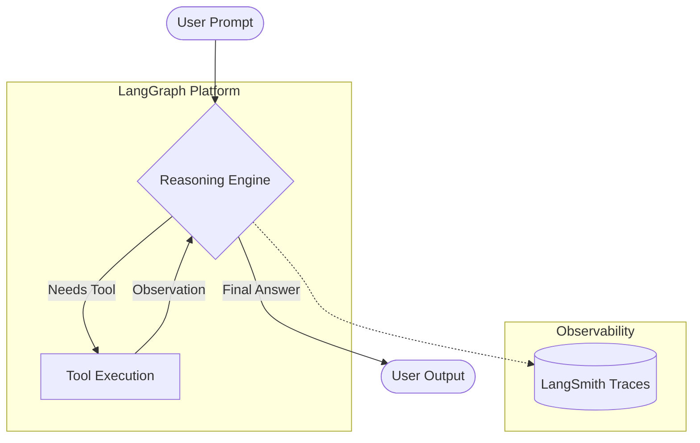

## Overview

**LangChain** is an open-source orchestrating framework designed to simplify the lifecycle of applications powered by **Large Language Models (LLMs)**. It acts as a modular "glue," connecting various **compute resources**, **data sources**, and **software tools** to create context-aware, reasoning systems.

In the current engineering landscape, developers face significant hurdles in state management, model lock-in, and grounding AI responses in private data. 

LangChain addresses these by providing a standardized interface that allows teams to swap providers (like OpenAI, Anthropic, or Google) and integrate **Retrieval-Augmented Generation (RAG)** to ensure fact-based outputs.

---

## Features & Drawbacks

| Feature | Description |
| :--- | :--- |
| **Standardized Interface** | Unified APIs to interact with different LLM providers seamlessly. |
| **Modular Chains** | Components can be "chained" together to automate complex, multi-step workflows. |
| **Agentic Reasoning** | LLMs use tools (search, code execution) to solve tasks autonomously. |
| **Built-in Memory** | Facilitates context retention across multi-turn conversations. |

### **Drawbacks**

| Drawback | Description |
| :--- | :--- |
| **Steep Learning Curve:** | The vast ecosystem of modules (LangGraph, LangSmith) requires significant time to master. |
| **Abstraction Complexity:** | High-level abstractions can sometimes make debugging underlying LLM behavior difficult. |
| **Dependency Overhead:** | Heavy reliance on third-party integrations can introduce security vulnerabilities. |

---

## Benefits & Use Cases

LangChain excels in scenarios where a standalone LLM lacks the necessary context or functional capability.

* **Knowledge Management:** Building internal RAG systems to query enterprise PDFs, docs, and wikis.
* **Customer Support Agents:** Creating stateful chatbots that remember user history and interact with CRM APIs.
* **Data Analysis:** Using agents to write and execute Python code or SQL queries against live databases.
* **Automated SDLC:** Orchestrating workflows for requirement analysis, code generation, and testing.

---

## Sample ReAct Agent

The following snippet demonstrates how to initialize a basic **ReAct Agent** using LangChain's modern `create_agent` pattern.

```python
from langchain_openai import ChatOpenAI
from langchain.agents import create_agent, AgentExecutor
from langchain_core.tools import tool

# 1. Define a custom tool
@tool
def get_word_length(word: str) -> int:
    """Returns the length of a word."""
    return len(word)

# 2. Initialize the LLM (Reasoning Engine)
llm = ChatOpenAI(model="gpt-4", temperature=0)

# 3. List of tools available to the agent
tools = [get_word_length]

# 4. Construct the Agent
# In LangChain 1.0+, agents often use LangGraph under the hood for cycles
agent_executor = AgentExecutor(agent=llm, tools=tools, verbose=True)

# 5. Execute
response = agent_executor.invoke({"input": "How many letters are in 'LangChain'?"})
print(response["output"])
```

---

## Architecture & Request Flow

LangChain's modern architecture is increasingly **graph-based**. While traditional "chains" were linear, current implementations often leverage **LangGraph** to support cyclic reasoning (the ReAct loop).

### The ReAct Loop

1. **Input:** User provides a prompt.
2. **Reasoning:** LLM decides if a tool is needed.
3. **Action:** The system executes the selected tool (e.g., a Web Search).
4. **Observation:** The tool's output is fed back to the LLM.
5. **Iteration:** Steps 2–4 repeat until a final answer is reached.



---

## Best Practices

| Concept | Key Details & Actions |
| ------- | --------------------- |
| **Use Specific Tool Descriptions** | The LLM decides which tool to use based solely on the description. Be explicit about input requirements and edge cases. |
| **Implement Prompt Caching** | For repetitive system prompts, use provider-specific features (like Anthropic's ephemeral caching) to reduce latency and costs. |
| **Enforce Output Parsing** | Use `StructuredOutput` to ensure the agent returns data in a predictable JSON format for downstream services. |
| **Prefer LangGraph for Complexity** | If your workflow requires "loops" or conditional branching, use LangGraph instead of legacy `SequentialChains`. |

---

## Challenges & Security Concerns

| Concept | Key Details & Actions |
| ------- | --------------------- |
| **Prompt Injection** | Malicious user inputs can hijack an agent's logic. **Always validate and sanitize** user inputs. |
| **Data Leakage** | Be cautious when sending **PII (Personally Identifiable Information)** to third-party LLM providers. Use anonymization or masking. |
| **Over-permissioning** | Follow the **Principle of Least Privilege**. Ensure tools (like SQL executors) have read-only access where possible. |
| **Latency** | Multi-step agent loops significantly increase response time. Implement **Streaming** to provide immediate feedback to the user. |

---

## Takeaways

| Concept | Key Details & Actions |
| ------- | --------------------- |
| **Modular Foundation** | LangChain standardizes the AI stack, allowing for flexible model and tool swapping. |
| **Context is King** | Through RAG and Memory, LangChain bridges the gap between static LLM training and dynamic enterprise data. |
| **Observability is Mandatory** | Use **LangSmith** to trace complex chains and identify exactly where an agent fails. |
| **The Future is Agentic** | Shifting from simple prompt-response to autonomous agents that use tools is the primary value proposition of the framework. |

---
