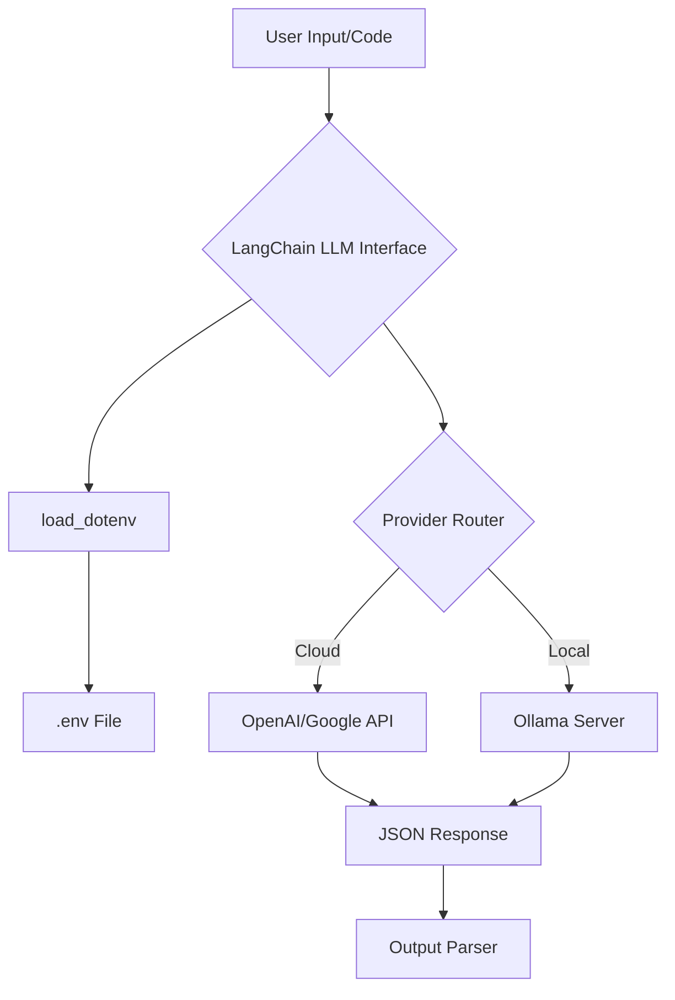

## Overview
Setting up a robust foundation is the most critical step in LLM application development. This guide focuses on using **UV**, an extremely fast Python package and gRPC-based project manager, to initialize a **LangChain** environment. We transition from "script-level" hacking to a structured engineering approach, incorporating local development via Ollama and production-grade formatting tools like Black and Isort.

## Features & Drawbacks

| Feature | Description | Pros | Cons |
| :--- | :--- | :--- | :--- |
| **UV Manager** | Rust-based pip alternative | Instant installs, unified project lockfiles. | Still maturing compared to Poetry. |
| **LangChain Modular** | Component-based framework | High flexibility and vendor-neutrality. | Steep learning curve; high abstraction. |
| **Ollama Support** | Local LLM hosting | Cost-effective; high data privacy. | Requires local GPU/RAM resources. |
| **Standard Tooling** | Black/Isort integration | Ensures clean, readable PRs and codebases. | Adds overhead to CI/CD pipelines. |

## Benefits & Use Cases
- **Rapid Prototyping:** Scaffolding a new AI agent in under 60 seconds using `uv init`.
- **Hybrid Cloud/Edge:** Seamlessly switching between OpenAI (Cloud) and Ollama (Local) for cost-saving development.
- **Reproducibility:** Strict version pinning ensures your RAG pipeline doesn't break when a dependency updates.

## Code Example

### 1. Environment Initialization
First, ensure Python and the UV manager are installed. Use the following commands to scaffold the project and inject LangChain dependencies.

```bash
# Initialize the project structure
uv init

# Install the core LangChain framework and provider-specific integrations
uv add langchain
uv add langchain-ollama
uv add python-dotenv

# Install developer experience (DX) utilities
uv add black isort
```

### 2. Environment Configuration (.env)
Create a `.env` file in your root directory. This keeps your secrets out of source control.

```bash
# OpenAI: Get from platform.openai.com
OPENAI_API_KEY=sk-xxxx...

# Google AI Studio: Get from aistudio.google.com
GOOGLE_API_KEY=AIzaSy...

# Ollama: Usually runs on localhost:11434 (No key required by default)
OLLAMA_HOST=http://localhost:11434
```

### 3. Verification Script
Use this snippet to ensure your environment is correctly loading variables and communicating with the LLM.

```python
import os
from dotenv import load_dotenv
from langchain_ollama import OllamaLLM
from langchain_openai import ChatOpenAI

# Load variables from .env
load_dotenv()

def verify_setup():
    # Verify OpenAI if key exists
    if os.getenv("OPENAI_API_KEY"):
        llm = ChatOpenAI(model="gpt-4o")
        print("✅ OpenAI Configured")
    
    # Verify Ollama (assuming it's running locally)
    try:
        local_llm = OllamaLLM(model="llama3")
        print("✅ Ollama Local Integration Ready")
    except Exception as e:
        print(f"❌ Ollama not detected: {e}")

if __name__ == "__main__":
    verify_setup()
```

## Architecture & Request Flow
The architecture follows a modular pattern where the **Environment Layer** feeds configuration into the **LangChain Abstraction Layer**, which then routes requests to either Cloud or Local providers.



## Best Practices
- **Use .gitignore:** Always add `.env` and `__pycache__` to your gitignore immediately. [cite_start]Never commit API keys. [cite: 1774]
- **Unified Formatting:** Run `black .` and `isort .` before every commit. This prevents "formatting noise" in code reviews.
- **Virtual Environments:** UV handles virtual environments automatically under the `.venv` folder. Ensure your IDE (VS Code/PyCharm) is pointed to this specific interpreter.
- [cite_start]**Provider Fallbacks:** Use LangChain's modularity to code against an interface, not a specific model, so you can swap `ChatOpenAI` for `ChatOllama` if an API goes down. [cite: 1356]

## Challenges & Security Concerns
- **API Key Leakage:** The most common failure point. [cite_start]Use secret management tools (AWS Secrets Manager, HashiCorp Vault) for production deployments. [cite: 1774]
- **Dependency Hell:** LLM libraries move fast. Regularly run `uv lock` to ensure consistent builds across your team.
- **Rate Limiting:** Cloud providers (OpenAI/Google) enforce strict rate limits. [cite_start]Implement exponential backoff in your LangChain `Runnable` chains to handle `429` errors. [cite: 1392]

## Takeaways
- **UV** is the modern standard for fast, reproducible Python environment management.
- **Ollama** enables free, private local development for most LangChain workflows.
- A structured `.env` file is mandatory for managing multi-provider (OpenAI, Google) integrations.
- Consistent formatting with **Black** and **Isort** is an "engineer-to-engineer" courtesy that keeps codebases maintainable.

---
