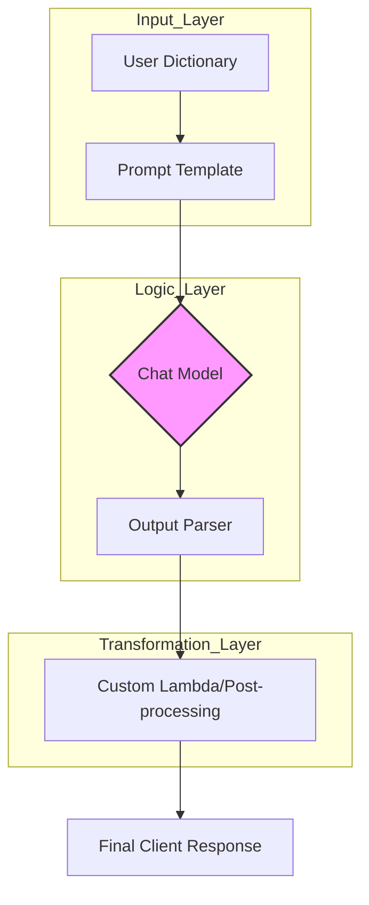

## Overview

In modern AI engineering, calling an LLM is the easiest part of the stack. The real challenge lies in **orchestration** that is managing dynamic prompts, switching between model providers, and ensuring structured data flow.

LangChain addresses this by providing a modular framework that treats LLM interactions as a series of composable units. By utilizing **Prompt Templates**, **Chat Models**, and **LCEL (LangChain Expression Language)**, engineers can move away from "spaghetti code" prompts toward maintainable, version-controlled pipelines.

---

## Features & Drawbacks

| Feature | Description | Drawback |
| :--- | :--- | :--- |
| **Prompt Templates** | Decouples prompt logic from application code. | Over-abstraction can make debugging complex prompts harder. |
| **Unified Interface** | Standardized API for OpenAI, Anthropic, and local models. | "Least common denominator" abstraction may hide niche model features. |
| **LCEL (Expression Lang)** | Declarative pipeline syntax using the `|` operator. | Requires a paradigm shift for developers used to imperative Python. |
| **Message Schemas** | Explicit handling of `System`, `Human`, and `AI` roles. | Slightly more verbose than passing raw strings to an API. |

---

## Benefits & Use Cases
*   **Context-Aware Chatbots:** Leveraging `ChatPromptTemplate` to maintain personality and system constraints across multi-turn sessions.
*   **Data Extraction:** Combining models with `OutputParsers` to transform unstructured text into valid JSON or Pydantic objects.
*   **Few-Shot Learning:** Using `FewShotPromptTemplate` to provide models with examples, significantly improving accuracy for niche domain tasks.
*   **Rapid Model Benchmarking:** Swapping models within an LCEL chain to compare performance without rewriting the logic.

---

## Code Example

The following implementation showcases the **LCEL (LangChain Expression Language)** pattern, which is the current industry standard for building modular chains.
```python
from langchain_openai import ChatOpenAI
from langchain_core.prompts import ChatPromptTemplate
from langchain_core.output_parsers import StrOutputParser
from langchain_core.runnables import RunnableLambda

# 1. Configuration: Decouple parameters for easy tuning
MODEL_NAME = "gpt-4o"
TEMPERATURE = 0.7

# 2. Template Definition: Explicit role separation
prompt = ChatPromptTemplate.from_messages([
    ("system", "You are a technical architect. Explain concepts for {audience}."),
    ("user", "{topic}")
])

# 3. Model Initialization
llm = ChatOpenAI(model=MODEL_NAME, temperature=TEMPERATURE)

# 4. LCEL Composition: Define the pipeline logic
# Input -> Prompt -> Model -> String Parser -> Custom Post-processing
chain = (
    prompt 
    | llm 
    | StrOutputParser() 
    | RunnableLambda(lambda x: x.upper()) # Example transformation
)

# 5. Execution
result = chain.invoke({
    "audience": "Junior Developers",
    "topic": "The Pipe Operator in LCEL"
})

print(result)
```

---

## Architecture & Request Flow

The architecture of a LangChain application relies on the **Runnable** protocol. Every component—from prompts to models—implements a standard interface (`invoke`, `stream`, `batch`), allowing them to be piped together seamlessly.




### ### Understanding the Roles
*   **System Message:** Sets the persona and "ground rules" for the LLM.
*   **Human Message:** The specific user request or dynamic input.
*   **AI Message:** The model's response, which can be fed back into the chain for multi-turn logic.

---

## Best Practices
1.  **Prioritize LCEL:** Avoid legacy `LLMChain`. LCEL provides out-of-the-box support for streaming and asynchronous calls (`ainvoke`), which are critical for UX.
2.  **Modularize Templates:** Keep your system prompts in separate files or a prompt management system to allow non-engineers to tweak copy without touching code.
3.  **Strict Parsing:** Always use `PydanticOutputParser` or function calling for production apps to ensure your backend receives structured data, not just raw strings.
4.  **Deterministic Benchmarking:** Use `temperature=0` during testing to ensure your chain logic is sound before introducing the "creativity" of higher temperatures.

---

## Challenges & Security Concerns
*   **Prompt Injection:** User-provided variables in templates can be used to bypass system instructions. Use guardrails and input validation.
*   **Cost Management:** Chains with multiple steps (e.g., Summarize -> Translate -> Analyze) can consume tokens rapidly. Implement caching strategies for frequent queries.
*   **Latency:** Every pipe step adds processing time. Use `RunnableParallel` when steps (like fetching context and formatting a prompt) don't depend on each other.

---

## Takeaways
LangChain is the "Standard Library" for LLM development. By mastering the core primitives, you move from simple API calls to building robust, autonomous systems.

*   **Templates** provide consistency and reusability.
*   **Chat Models** provide the reasoning engine with role-based control.
*   **LCEL** is the glue that binds components into a high-performance pipeline.
*   **Separation of Concerns** between prompts, models, and parsers is the key to scaling AI features.

---
