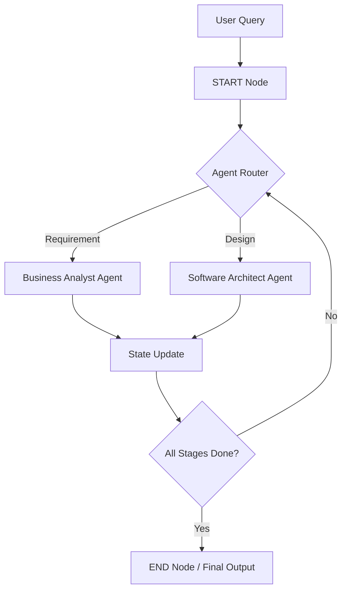

## Overview

Integrating Large Language Models (LLMs) into a Python application requires more than just API calls; it requires a structured framework to manage prompts, memory, and external data.

**LangChain** serves as this orchestration layer, allowing you to transform a standard Python script into a sophisticated AI application.

In this article, we will walk through the core mechanics of connecting LangChain to Python backend application. You will learn how to initialize **Prompt template**, **ChatModels**, construct **Chains** to link multiple tasks.

By the end of this article, you will have a functional Python implementation capable of:

* Managing stateful conversations using **Memory** components.
* Parsing unstructured data into validated Python objects.
* Executing **Agentic** loops where the LLM decides which Python functions to call based on user intent.

---

## Features & Drawbacks

| Feature | Description | Drawback |
| :--- | :--- | :--- |
| **Modularity** | Components like `PromptTemplates` and `OutputParsers` are swappable. | Increased complexity and a steeper learning curve for new engineers. |
| **State Management** | LangGraph allows for persistent memory and cyclic flows. | Maintaining state across long-running sessions requires robust infrastructure. |
| **Integration Support** | Native support for providers like OpenAI, Google, and Ollama. | Heavy reliance on third-party APIs can lead to vendor lock-in or dependency risks. |

## Benefits & Use Cases

* **SDLC Automation:** Automating the "Waterfall" or "Spiral" models by assigning specific agents to roles like Business Analyst or Software Architect.
* **Context-Aware Chatbots:** Building customer support tools that retain multi-turn conversation history through persistent memory.
* **RAG Pipelines:** Enhancing model accuracy by retrieving data from external vector stores like Milvus or Chroma before generating responses.

## Hello World App

The following snippet demonstrates a foundational LangChain application. It utilizes a `PromptTemplate` to structure raw data into a summarized format using a locally hosted model via **Ollama**.

```python
import os
from dotenv import load_dotenv
from langchain_core.prompts import PromptTemplate
from langchain_ollama import ChatOllama

# Initialize environment configuration
load_dotenv()

def main():
    # Define the template for the LLM's reasoning
    summary_template = """
        Given the information {information} about a person, create:
        1. A short summary
        2. Interesting facts about them.
    """

    summary_prompt_template = PromptTemplate(
        input_variables=["information"], 
        template=summary_template
    )

    # Configure the Local LLM (e.g., Gemma 3 via Ollama)
    model_name = os.getenv("OLLAMA_GEMMA3_MODEL")
    llm = ChatOllama(model=model_name, temperature=0)

    # Chain the components using LCEL (LangChain Expression Language)
    chain = summary_prompt_template | llm

    # Execute the chain with raw input data
    raw_data = "Elon Musk is a businessman... [truncated]"
    response = chain.invoke(input={"information": raw_data})

    print(response.content)

if __name__ == "__main__":
    main()
```

---

## Architecture & Request Flow

LangChain follows a modular pipeline where data moves from ingestion to final structure. For complex tasks like SDLC automation, **LangGraph** introduces nodes (representing agents or functions) and edges (defining the execution path).



*Figure 1: High-level representation of a cyclic agentic workflow for SDLC.*

## Best Practices

* **Granular Permissions:** Follow the principle of least privilege. Grant agents only the specific API keys and tool access necessary for their defined task.
* **Temperature Control:** Set `temperature=0` for logic-heavy tasks (like math or coding) to ensure deterministic and consistent outputs.
* **Observability:** Integrate **LangSmith** early to trace request flows and identify bottlenecks in your chains or graphs.

## Challenges & Security Concerns

* **Data Privacy:** Sending sensitive PII to external LLM providers can lead to unintended data exposure.
* **Prompt Injection:** Malicious inputs can cause agents to execute unauthorized tool calls or skip safety guardrails.
* **Inaccurate Reasoning:** LLMs often struggle with complex math or logic, requiring specific system instructions to "never attempt math alone" but rather use a specialized calculator tool.

## Takeaways

LangChain provides the building blocks, but the true value lies in the **orchestration** of these blocks into stateful, reliable workflows.

* **State is King:** Use LangGraph for workflows that require loops, feedback, or long-term persistence.
* **Standardization:** Use `PromptTemplates` to ensure consistent interaction across different model providers.
* **Safety First:** Always validate and sanitize inputs/outputs to protect against injection attacks.

---
