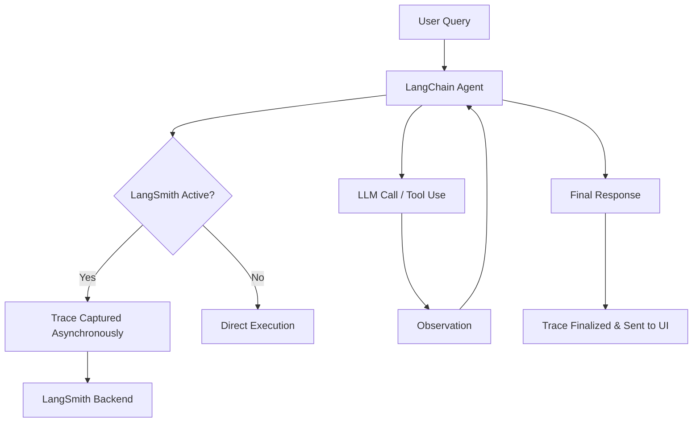

## What is LangSmith ?

**LangSmith** is a developer platform designed to streamline the deployment, monitoring, and evaluation of Large Language Model (LLM) applications.

It acts as a centralized hub for tracing complex chains, managing evaluation datasets, and monitoring real-time performance metrics like latency and token costs.

## Features & Drawbacks

| Feature | Description |
| :--- | :--- |
| **Unified Tracing** | Captures every LLM call, input parameter, and output in a nested tree. |
| **Dataset Management** | Create test cases from production logs or manual curation for unit testing. |
| **Evaluation Suite** | Supports "LLM-as-a-judge," code-based heuristics, and human-in-the-loop review. |
| **Online Monitoring** | Real-time tracking of production traffic to detect anomalies and quality drift. |

## Drawbacks

* **Complexity:**
  * Requires understanding of distinct modules like LangGraph for advanced state tracing.
* **Cost:**
  * High-volume tracing can lead to significant data storage costs if sampling is not implemented.
* **Learning Curve:**
  * New users may find the extensive UI and SDK options overwhelming.

## Benefits & Use Cases

* **Debugging Agents:**
  * Trace multi-step reasoning loops to identify where an agent "lost the plot" or selected the wrong tool.
* **Regression Testing:**
  * Before redeploying a prompt, run it against a historical dataset to ensure output quality hasn't dropped.
* **Cost Optimization:**
  * Analyze token usage patterns across different model providers to identify expensive outliers.
* **Human-in-the-loop:**
  * Use annotation queues to allow subject matter experts to grade LLM responses.

## Configuration & Integration

Integrating LangSmith into a LangChain application is primarily handled via **environment variables**.

This "zero-code" approach allows for automatic tracing without modifying your business logic.

### 1. Environment Setup

Add following configuration to your `.env` file. Alternatively these can be exported in your shell as well.

```bash
# Enable tracing for all LangChain components
export LANGSMITH_TRACING=true

# Your API Key from the LangSmith dashboard
export LANGSMITH_API_KEY="ls__your_api_key_here"

# Optional: Organize traces by project name
export LANGSMITH_PROJECT="production-chatbot-v1"

# Optional: Configure an endpoint if using a self-hosted instance
export LANGSMITH_ENDPOINT=https://api.smith.langchain.com

export OPENAI_API_KEY=--na-integrating-to-ollama--
```

### 2. Manual Tracing (Advanced)

For functions outside of standard LangChain objects, use the `@traceable` decorator:

```python
from langsmith import traceable

@traceable
def my_custom_logic(input_text):
    # This logic will now appear as a node in the LangSmith trace tree
    return input_text.upper()
```

## Sample code

The following snippet demonstrates a standard LangChain agent initialization with LangSmith tracing active.

```python
import os
from langchain_openai import ChatOpenAI
from langchain.agents import create_agent

# 1. Config initialized via Environment Variables (LANGSMITH_TRACING=true)

# 2. Initialize LLM
llm = ChatOpenAI(model="gpt-4", temperature=0)

# 3. Define Tools
def search_tool(query: str):
    """Searches the internal knowledge base."""
    return "Relevant context found..."

# 4. Create Agent (LangSmith will automatically wrap this)
agent_executor = create_agent(
    model=llm,
    tools=[search_tool],
    # LangSmith will trace the system prompt and ReAct loop
    system_prompt="You are a helpful assistant."
)

# 5. Execution - This triggers an entry in the LangSmith Project UI
response = agent_executor.invoke({"messages": [("human", "What is the status of my order?")]})
```

## Architecture & Request Flow

LangSmith captures data asynchronously to ensure that tracing does not significantly impact the latency of your primary application.

### Request Flow Diagram



## Best Practices

* **Use Projects:**
  * Separate your `development`, `staging`, and `production` environments into different projects to avoid cluttering your metrics.

* **Implement Sampling:**
  * For high-traffic production apps, use sampling rates to capture a percentage of traces, reducing costs while maintaining statistical relevance.

* **Version Everything:**
  * Use LangSmith’s dataset version control to track how application logic changes correlate with evaluation scores over time.

* **Traceable Wrappers:**
  * Wrap third-party API calls (e.g., database lookups) so they appear in the trace tree, making it easier to spot non-LLM bottlenecks.

## Challenges & Security Concerns

* **PII Leakage:**
  * Traces capture raw inputs and outputs. Ensure that Personally Identifiable Information (PII) is masked or anonymized before being sent to LangSmith.

* **Data Retention:**
  * Review and configure data retention policies to comply with local regulations (like GDPR) regarding how long user logs are stored.

* **Secret Management:**
  * Never hardcode your `LANGSMITH_API_KEY`. Use secret management tools like AWS Secrets Manager or environment variables.

* **Dependency Updates:**
  * Regularly update the `langsmith` and `langchain` packages to patch security vulnerabilities in underlying libraries.

## Takeaways

LangSmith is the "X-ray" for your LLM application. By simply setting environment variables, you gain:

* **Full Visibility:**
  * Every step of your chain or agent is recorded.
* **Rigorous Testing:**
  * Move beyond "vibe checks" to quantitative evaluation using datasets.
* **Production Readiness:**
  * Monitor latency, cost, and errors in real-time to maintain high service levels.

### Key terms to remember

* **Trace:** A record of a single interaction with your application.
* **Run:** A single unit of work within a trace (e.g., one LLM call).
* **Dataset:** A collection of inputs and (optional) reference outputs for testing.

---
