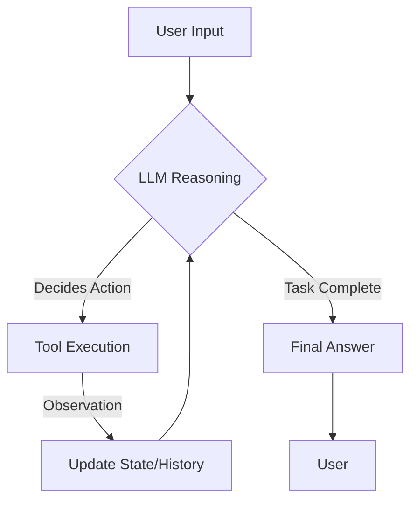

## What are AI Agents ?

Traditional LLM implementations often rely on **hard-coded chains** where the sequence of events is predefined by the developer. While efficient for simple tasks, these "chains" fail when faced with ambiguity or multi-step logic.

**AI Agents** represent a paradigm shift, they use the LLM as a **reasoning engine**. Instead of following a fixed script, an agent dynamically determines which tools to call and what steps to take based on the user's goal.

By combining a model's linguistic intelligence with external **Tools**, agents can interact with the real world, such as calling APIs, querying databases, scanning local system or executing code in an iterative loop until a task is complete.

For your tutorial blog, having a clear and technically precise structure is key. Below is a refined version of your definitions, polished for readability and professional tone while maintaining the "Geekmonks" technical edge.

---

## What is an AI Agent?

Traditional LLM implementations often rely on **hard-coded chains** where the sequence of events is predefined by the developer. While efficient for simple tasks, these "chains" fail when faced with ambiguity or multi-step logic.

While **AI Agents** represent a paradigm shift, they use the LLM as a **reasoning engine** and instead of following a fixed script, an agent dynamically determines which tools to call and what steps to take based on the user's goal.

* **Dynamic Decision Making:**
  * While standard chains (like LangChain’s basic sequences) follow a hard-coded path, agents dynamically decide which steps to take based on the user's input.
* **The Reasoning Engine:**
  * The LLM doesn't just generate text; it plans, evaluates its progress, and adjusts its strategy.
* **The Equation:**
  * You can think of an agent as:  
    $$\text{Agent} = \text{LLM (Reasoning)} + \text{Planning} + \text{Memory} + \text{Tools (Execution)}$$

---

## What is a ReAct Agent?

The **ReAct** (Reasoning and Acting) framework is one of the most influential architectures for building agents. It was introduced to solve the "hallucination" and "isolation" problems of LLMs by allowing them to talk to themselves and the outside world simultaneously.

* **Reason + Act:**
  * The name is a portmanteau of **Reasoning** and **Acting**.
  * The agent follows a loop- it thinks about what to do, takes an action, observes the result, and then thinks again.
* **Chain of Thought (CoT):**
  * It uses "Chain of Thought" prompting to "talk out loud."
  * By articulating its reasoning steps, the LLM is significantly less likely to make logical errors.
* **The Stepping Stone:**
  * Since the 2022 research paper, ReAct has become the industry standard for implementing agentic workflows in frameworks like LangChain and CrewAI.

---

## What are Tools?

**Tools** are the "hands" of the LLM. By default, an LLM is a "brain in a jar"—it knows a lot but can’t do anything. Tools provide the interfaces that allow an LLM to interact with external systems.

* **Functional Capabilities:**
  * Tools can be anything from a simple Python function that calculates a mortgage to complex interfaces like Google Search, a SQL database, or a Slack API.
* **Pre-defined Interfaces:**
  * Developers define these tools beforehand. When the LLM decides it needs a specific piece of information, it "calls" the tool, waits for the data, and then continues its reasoning.
* **Unlimited Extensibility:**
  * Because tools are essentially wrapped code, you can equip an LLM with virtually any capability, if you can write it in code, the agent can use it.

---

### The Iterative Loop

The power of these three components comes together in the **Execution Loop**:

| # | Step | Task |
| :- | :---- | :---- |
| 1. | **Input** | User asks a complex question. |
| 2. | **Reasoning (ReAct)** | The Agent thinks, *"I need to find the current stock price of Apple."* |
| 3. | **Action (Tool)** | The Agent calls a Finance API tool. |
| 4. | **Observation** | The tool returns "$190.50". |
| 5. | **Refinement** | The Agent thinks, *"Now that I have the price, I can answer the user."* |
| 6. | **Output** | Final answer delivered. |

---

## Features & Drawbacks

| Feature | Description |
| :--- | :--- |
| **Dynamic Reasoning** | Uses the **ReAct** (Reasoning + Acting) paradigm to "think" before taking action. |
| **Tool Integration** | Equips LLMs with the ability to execute Python code, search the web, or query SQL. |
| **State Persistence** | Maintains "short-term memory" across long-running tasks using **LangGraph**. |
| **Iterative Feedback** | Agents can observe tool outputs and correct their course if the first attempt fails. |

**Drawbacks:**

* **Latency:**
  * Multiple "reasoning hops" increase the time to final response.
* **Cost:**
  * Iterative loops consume significantly more tokens than single-shot prompts.
* **Reliability:**
  * Agents can occasionally enter "infinite loops" if not properly constrained.

---

## Benefits & Use Cases

AI Agents excel in environments where the path to a solution is not linear.

* **Automated SDLC:** Agents can handle requirement gathering, architectural planning, and initial code scaffolding autonomously.
* **Dynamic Customer Support:** Unlike basic bots, agents can look up a user's specific order, check shipping status via API, and issue a refund logic-path dynamically.
* **Research & Data Analysis:** Agents can search multiple sources, synthesize findings, and generate a report, adjusting their search queries based on interim results.

---

## Code Example

Below is a conceptual implementation of a ReAct agent using the modern `create_agent` pattern in LangChain, which leverages **LangGraph** under the hood.

```python
from langchain_openai import ChatOpenAI
from langchain_core.tools import tool
from langgraph.prebuilt import create_agent

# 1. Define custom tools
@tool
def calculate_circumference(radius: float) -> float:
    """Calculates the circumference of a circle given its radius."""
    import math
    return 2 * math.pi * radius

# 2. Initialize the reasoning engine (LLM)
# Low temperature is critical for tool-calling stability
llm = ChatOpenAI(model="gpt-4o", temperature=0)

# 3. Create the Agent
# Tools give the LLM 'hands' to interact with the world
tools = [calculate_circumference]
agent_executor = create_agent(llm, tools)

# 4. Execute a task
response = agent_executor.invoke({"messages": [("user", "What is the circumference of a circle with radius 5?")]})
print(response["messages"][-1].content)
```

---

## Architecture & Request Flow

The core of modern agents is the **ReAct Loop**. This paradigm combines **Chain-of-Thought (CoT)** prompting with action execution. The model generates a "Thought," decides on an "Action," receives an "Observation" from a tool, and repeats the process.

### Request Flow (Mermaid)



---

## Best Practices

* **Prompt Engineering:** Use specific system prompts to define the agent's persona and constraints. For example, explicitly tell the model *when* to use a tool versus relying on internal knowledge.
* **Tool Granularity:** Keep tools specialized. A tool that does one thing well (e.g., `get_user_email`) is better than a generic `do_everything` tool.
* **Low Temperature:** Always set `temperature=0` when building agents to ensure the model follows tool schemas precisely and reduces hallucination during the reasoning phase.
* **Human-in-the-Loop:** For high-stakes tasks (e.g., production database writes), use **LangGraph** to implement a "wait for approval" state before tool execution.

---

## Challenges & Security Concerns

* **Prompt Injection:** Malicious users may try to bypass agent instructions to force tools to execute unauthorized commands.
* **Data Privacy:** PII (Personally Identifiable Information) can be leaked to external LLM providers if not sanitized before the reasoning step.
* **Sandboxing:** **Never** run agent-generated code (e.g., PythonREPL tool) outside of a sandboxed or containerized environment.
* **Costs:** Without a `max_iterations` cap, agents can cost significant amounts of money if they get stuck in a reasoning loop.

---

## Takeaways

AI Agents represent the evolution from static code to dynamic reasoning. By integrating LangChain's tool-calling capabilities with LangGraph's state management, engineers can build systems that adapt to complex user needs in real-time.

* **Agents = LLM (Reasoning) + Tools (Acting) + Memory (State)**.
* **ReAct** is the foundational architecture for modern agentic workflows.
* **Evolution:** We have moved from basic `ReAct` prompts to native **Function Calling** and graph-based orchestration with **LangGraph**.
* **Control:** Use **LangSmith** to trace agent execution paths and identify where reasoning goes off the rails.

---
